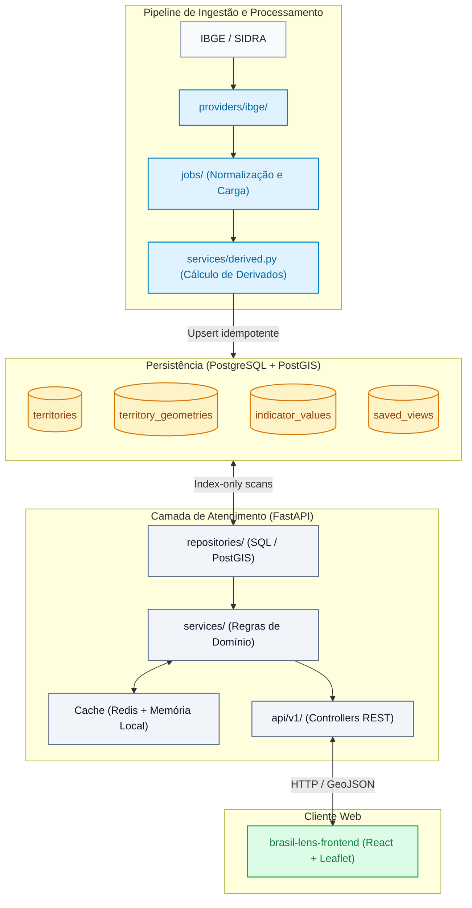
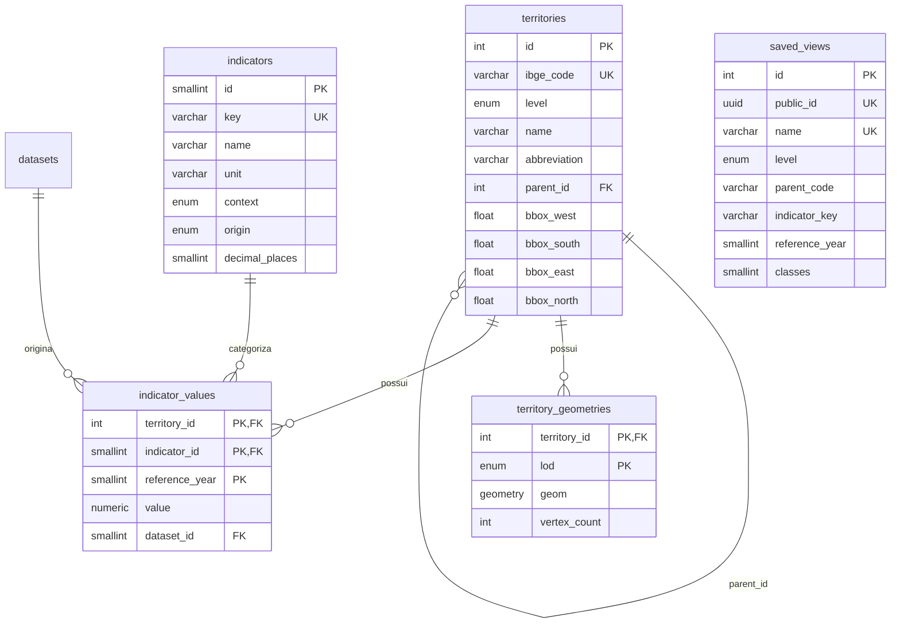

# Arquitetura do Sistema — Brasil Lens Backend

Este documento descreve as decisões de arquitetura, contratos de dados, modelo relacional e estratégias de desempenho do backend do **Brasil Lens**.

---

## 1. Decisões Fundamentais de Arquitetura

- **Isolamento de fontes externas:** O frontend não acessa diretamente APIs externas (IBGE, Open-Meteo, INPE, etc.). Toda comunicação é mediada pelo backend, garantindo estabilidade contratual, cache unificado e transformação prévia de dados.
- **Monólito modular:** A aplicação foi estruturada como um monólito modular organizado por camadas (`providers/` → `jobs/` → `repositories/` → `services/` → `api/`), compartilhando o núcleo de dados espaciais e socioeconômicos sem a sobrecarga operacional de microsserviços.
- **Entidade territorial unificada:** Estados, regiões e municípios residem na mesma tabela (`territories`), relacionados hierarquicamente por `parent_id`. Essa abordagem simplifica chaves estrangeiras, consultas espaciais e drill-down cartográfico.
- **Projeção cartográfica consolidada (`/map`):** O endpoint `/map` entrega geometrias GeoJSON simplificadas, valores, estatísticas agregadas e faixas de quantil em uma única requisição, evitando consultas N+1 no cliente.
- **Separação de malhas e valores (`/map/values`):** Para trocas de indicador ou ano no mesmo território, a rota `/map/values` transfere apenas os valores tabulares e classes de cor, reaproveitando as geometrias já renderizadas.
- **Processamento geoespacial antecipado (LOD):** Simplificações topológicas são calculadas durante a ingestão via PostGIS (`ST_SimplifyPreserveTopology`), gerando níveis de detalhe (`overview` e `detail`). Nenhuma operação pesada de simplificação ocorre em tempo de requisição.

---

## 2. Visão Geral da Arquitetura e Fluxo de Dados

---

## 3. Modelo de Dados Relacional

O esquema de banco de dados foi estruturado para assegurar integridade relacional, consultas espaciais indexadas e suporte a séries temporais:

### Regras Centrais do Modelo
1. **Idempotência por Chave Natural:** A chave composta `(territory_id, indicator_id, reference_year)` em `indicator_values` viabiliza operações de *upsert* (`ON CONFLICT DO UPDATE`) sem criação de registros duplicados em reingestões.
2. **Separação de Geometrias e Níveis de Detalhe:** A tabela `territory_geometries` utiliza a chave composta `(territory_id, lod)`. O nível `canonical` armazena a geometria oficial íntegra, enquanto `overview` e `detail` atendem às necessidades de visualização em diferentes escalas com índice GiST.
3. **Persistência de Indicadores Derivados:** Indicadores calculados (`population_density`, `gdp_per_capita`, `urbanization_rate`, `population_growth`, `gdp_share_national`) são materializados na tabela `indicator_values` durante a ingestão, permitindo que a camada de consulta trate indicadores originais e derivados sob a mesma interface indexada.

---

## 4. Estratégia de Desempenho e Cache

A arquitetura combina pré-processamento, indexação especializada e cache em múltiplos níveis:

| Camada | Mecanismo | Comportamento e Benefício |
|---|---|---|
| **Banco de Dados** | Índice Cobridor PostGIS | `ix_indicator_values_indicator_year` cobre `(indicator_id, reference_year) INCLUDE (territory_id, value)`, viabilizando *index-only scan* nas consultas do mapa. |
| **Geometrias** | Níveis de Detalhe (LOD) | Polígonos de estados (`overview`) consom ~45 KB comprimidos; municípios de uma UF (`detail`) consomem ~300–550 KB comprimidos, dispensando servidores adicionais de tiles vetoriais. |
| **Memória da API** | Cache TTL em Processo | Projeções nacionais e catálogos são mantidos em memória de processo com expiração e revalidação orientadas à versão da última ingestão. |
| **Cache Distribuído** | Redis 7.4 | Armazena leituras meteorológicas, agregações espaciais e consultas pontuais de focos de calor com TTLs calibrados por serviço (10 a 30 minutos). |
| **Controle HTTP** | ETag e Cache-Control | O ETag combina os parâmetros da projeção com a versão dos dados ingeridos. Respostas 304 Not Modified são atendidas sem consultar o PostGIS. |

---

## 5. Contextos de Dados e Extensibilidade

A plataforma organiza indicadores e camadas em dois contextos principais:
- **`sociopolitical`:** Indicadores demográficos, econômicos e censitários do IBGE.
- **`climate_environmental`:** Condições meteorológicas (Open-Meteo), alertas de riscos geo-hidrológicos (INMET/CEMADEN), focos de calor (INPE/BDQueimadas) e hidrografia (ANA).

### Adição de Novos Indicadores e Provedores
A inclusão de novas origens segue fluxo padronizado:
1. **Novo indicador de fonte existente:** Cadastro em `providers/ibge/datasets.py` e registro declarativo no catálogo em `jobs/seed_indicators.py`.
2. **Novo indicador derivado:** Declaração da especificação de cálculo (`RatioIndicatorSpec`, `GrowthIndicatorSpec` ou `ShareIndicatorSpec`) em `services/derived.py`.
3. **Novo provedor externo:** Implementação de adaptador em `providers/<fonte>/` que produza registros normalizados no contrato `IndicatorObservation` e registro no descritor de provedores em `providers/registry.py`.

As camadas de repositório, serialização e endpoints públicos permanecem estáveis e desacopladas das particularidades de cada provedor externo.
