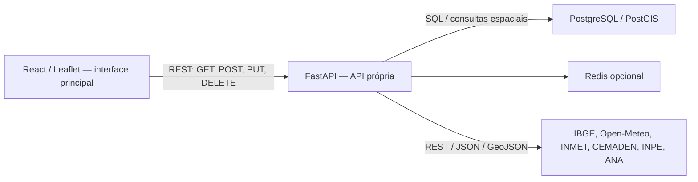

# Arquitetura

A API é um monólito modular: `providers` convertem fontes externas em registros internos; `jobs` ingerem dados; `repositories` consultam PostgreSQL/PostGIS; `services` aplicam regras; `api/v1` expõe os contratos HTTP.

## Componentes e comunicação

```mermaid
flowchart LR
    Web["React / Leaflet — interface principal"] -->|"REST: GET, POST, PUT, DELETE"| API["FastAPI — API própria"]
    API -->|"SQL / consultas espaciais"| DB["PostgreSQL / PostGIS"]
    API --> Cache["Redis opcional"]
    API -->|"REST / JSON / GeoJSON"| Fontes["IBGE, Open-Meteo, INMET, CEMADEN, INPE, ANA"]
```

Frontend e backend têm [repositórios](https://github.com/henriquexaud/brasil-lens-frontend) [públicos separados](https://github.com/henriquexaud/brasil-lens-backend), Dockerfiles e READMEs próprios. As APIs externas formam o terceiro componente: seus dados são processados e integrados ao domínio, sem credenciais pagas. O Compose completo fica no backend; um Compose adicional na pasta de trabalho permite desenvolver clones locais juntos.

A interface usa GET para consultas, POST para localização por coordenadas e preferências de avisos, PUT para acompanhar municípios e DELETE para removê-los. A API oferece mais de quatro operações e persiste o acompanhamento no PostgreSQL. Mapas ambientais, interpolação, alertas e densidade espacial constituem as funcionalidades além do CRUD.

## Domínio territorial

`territories` mantém país, regiões, estados e municípios numa hierarquia única, relacionada por `parent_id`. `ibge_code` preserva os códigos oficiais. As colunas `bbox_*` aceleram o enquadramento do mapa e os índices normalizados apoiam busca sem acentos.

`territory_geometries` guarda as malhas canônicas do IBGE e duas simplificações (`overview`, `detail`). `/map` serve as geometrias simplificadas; a consulta paginada de limites municipais pode servir a malha canônica. O PostGIS usa GiST para consultas espaciais, como viewport e localização por ponto.

Essas tabelas são necessárias à experiência climática e permanecem compartilhadas por busca, navegação, foco de município e camadas ambientais.

A projeção do mapa retorna diretamente as linhas geográficas, sem um objeto intermediário de indicador/ano. O território pai é validado e resolvido em uma única consulta. Detalhes territoriais são montados diretamente no contrato `TerritoryDetail`.

## Fontes e dados ambientais

- IBGE Localidades e Malhas: nomes, códigos e geometrias.
- Open-Meteo: condições e previsão.
- INMET: estações, observações e alertas meteorológicos.
- CEMADEN: alertas geo-hidrológicos.
- INPE: focos de calor.
- ANA/SNIRH: hidrografia.

`datasets` e `ingestion_runs` registram proveniência e execução dos jobs territoriais e ambientais. As tabelas `weather_stations`, `weather_observations` e `weather_alerts` preservam dados temporais de fontes climáticas.

## Cache e atualização

A malha usa cache local e Redis, com chave versionada pela última importação territorial/geográfica e ETag HTTP. A consulta da versão de ingestão é compartilhada por até 60 segundos; quando uma nova versão é observada, os derivados geográficos passam a usar novas chaves. O namespace `v4` isola o contrato atual; chaves de versões anteriores expiram por TTL, sem varredura no startup. Dados meteorológicos têm TTLs próprios. Redis indisponível não impede a consulta ao banco ou às fontes.

O agendador atualiza alertas do INMET e CEMADEN no processo da API; condições e previsões da Open-Meteo são consultadas sob demanda. A ingestão legada de estações do INMET permanece disponível pela CLI e não roda no agendador. A hidrografia pode ser aquecida em segundo plano para evitar o custo da primeira consulta.

## Persistência

As tabelas vigentes mantêm geografia, proveniência de ingestão, estações, observações, alertas e municípios acompanhados. A migration `0009` remove tabelas e enums do antigo catálogo estatístico e das coropletas anuais. Ela preserva territórios, geometrias, PostGIS e modelos ambientais.

Antes de aplicar `0009_remove_socioeconomic`, faça backup do banco. O upgrade exclui os dados estatísticos e as visualizações salvas, além dos datasets e registros de ingestão exclusivos desse domínio que não tenham referências geográficas ou ambientais. O downgrade restaura o schema anterior, incluindo constraints, índices e enums; recuperar dados excluídos exige restaurar o backup. As migrations anteriores permanecem no histórico para instalações novas e upgrades de bancos existentes.
