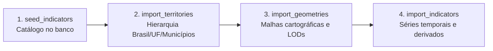

# Ingestão e Fontes de Dados — Brasil Lens

Este documento descreve como os dados públicos do IBGE são coletados, validados, normalizados e persistidos no PostgreSQL/PostGIS.

---

## 1. Princípios da Ingestão

1. **Desacoplamento Total:** O frontend **nunca** faz requisições diretas às APIs externas. Todos os dados são ingeridos previamente via jobs assíncronos no backend.
2. **Idempotência Estrita:** Executar um job múltiplas vezes com os mesmos dados de entrada não gera duplicações e não altera registros inalterados.
3. **Resiliência a Instabilidades Externas:** Falhas de rede transitórias ou limites de taxa são tratadas com retentativas com backoff exponencial. Se uma UF falhar, os dados das UFs bem-sucedidas são commitados e o status da execução é registrado como `partial`.
4. **Rastreabilidade e Auditoria:** Cada execução de job é gravada na tabela `ingestion_runs`, incluindo total de registros processados, gravados, falhos e detalhes de erros.

---

## 2. Fontes de Dados Externas (IBGE)

Todas as fontes consumidas são abertas e gratuitas (não exigem chaves ou autenticação):

| API | Endpoints Utilizados | Finalidade |
|---|---|---|
| **Localidades v1** | `/api/v1/localidades/{regioes,estados,municipios}` | Hierarquia territorial (Brasil → Regiões → UFs → Municípios), capitais e códigos IBGE. |
| **Malhas Geográficas v3** | `/api/v3/malhas/paises/BR`<br>`/api/v3/malhas/estados/{uf}` | Geometrias oficiais em GeoJSON para os 4 níveis territoriais. |
| **Agregados v3 (SIDRA)** | `/api/v3/agregados/{tabela}/periodos/{p}/variaveis/{v}` | Séries estatísticas oficiais de população, economia e renda. |

> **Nota:** O endpoint clássico `apisidra.ibge.gov.br` não é utilizado por retornar HTTP 403 (bloqueio anti-bot). A API de Agregados v3 é a interface programática oficial suportada.

---

## 3. Catálogo de Indicadores

O Brasil Lens disponibiliza 14 indicadores consolidados, combinando dados originais do IBGE e indicadores derivados calculados durante a ingestão:

| Indicador | Tipo | Unidade | Fonte IBGE | Cobertura Temporal |
|---|---|---|---|---|
| `population` | Original | Habitantes | Tabelas 6579 (estimativas), 4714 (Censo 2022) e 202 (Censo 2010) | 2001–2026 (24 anos) |
| `population_growth` | **Derivado** | % a.a. | Variação geométrica anual sobre a série populacional | 2002–2026 (23 anos) |
| `area_km2` | Original | km² | Tabela 4714 (2022) e 1301 (2010) | 2010 e 2022 |
| `population_density` | **Derivado** | hab./km² | Razão entre população e área territorial | 2001–2026 (24 anos) |
| `urban_population` | Original | Habitantes | Tabela 9923 (Censo 2022) e 202 (Censo 2010), categoria urbana | 2010 e 2022 |
| `urbanization_rate` | **Derivado** | % | Razão entre população urbana e população total | 2010 e 2022 |
| `gdp` | Original | BRL | Tabela 5938 (PIB municipal a preços correntes) | 2002–2023 (22 anos) |
| `gdp_share_national` | **Derivado** | % | Participação percentual do território no PIB nacional do ano | 2002–2023 (22 anos) |
| `gdp_per_capita` | **Derivado** | BRL | Razão entre PIB e população do território | 2002–2023 (22 anos) |
| `gdp_agriculture` | Original | BRL | Tabela 5938 (VAB Agropecuária) | 2002–2021 (20 anos) |
| `gdp_industry` | Original | BRL | Tabela 5938 (VAB Indústria) | 2002–2021 (20 anos) |
| `gdp_services` | Original | BRL | Tabela 5938 (VAB Serviços Privados + Administração Pública) | 2002–2021 (20 anos) |
| `household_income_per_capita`| Original | BRL | Tabela 7395 (PNAD Contínua anual domiciliar) | 2016–2025 (Brasil/UF) |
| `unemployment_rate` | Original | % | Tabelas 4562 (PNAD anual) e 6468 (PNAD trimestral) | 2012–2026 (Brasil/UF) |

---

## 4. Jobs de Ingestão e Orquestração

A ingestão é dividida em quatro etapas modulares, orquestradas pelo módulo `app.jobs`:



### Comandos de Execução

A execução dos jobs pode ser realizada via container Docker ou diretamente no ambiente configurado:

```bash
# Executar o fluxo completo (recomendado na primeira inicialização):
docker compose run --rm api python -m app.jobs.bootstrap

# Ou executar etapas individuais:
docker compose run --rm api python -m app.jobs.seed_indicators    # Catálogo
docker compose run --rm api python -m app.jobs.import_territories # Territórios
docker compose run --rm api python -m app.jobs.import_geometries  # Malhas GeoJSON
docker compose run --rm api python -m app.jobs.import_indicators  # Indicadores
```

### Flags Úteis para Desenvolvimento

- `--skip-municipal-geometries`: Pula a malha detalhada de municípios (~60 MB). Ideal para inicialização rápida em ambientes de teste.
- `--states 35,31`: Limita a importação de geometrias ou indicadores apenas para as UFs especificadas (ex.: SP e MG).
- `--periods "2022|2023"`: Recorta a ingestão de indicadores para anos específicos.

---

## 5. Garantia de Idempotência e Armazenamento

1. **Chaves Naturais Únicas:** A tabela `indicator_values` adota a restrição primária composta `(territory_id, indicator_id, reference_year)`.
2. **Upsert Não-Destrutivo:** Os comandos de gravação utilizam cláusulas `ON CONFLICT (territory_id, indicator_id, reference_year) DO UPDATE SET ... WHERE valor IS DISTINCT FROM novo_valor`. Se o valor retornado pela fonte não mudou, nenhuma linha é reescrita e os carimbos de `updated_at` são preservados.
3. **Níveis de Detalhe (LOD):** As geometrias municipais e estaduais são simplificadas no momento da ingestão (via algoritmo Douglas-Peucker implementado no PostGIS), gerando versões `overview` (alta compressão para visualização geral) e `detail` (para maior aproximação).

