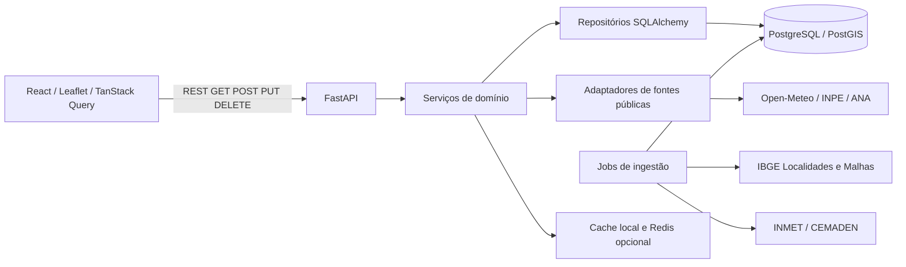

# Revisão do projeto — 27/09/2026

## Escopo e diagnóstico inicial

Revisão conjunta dos repositórios públicos [backend](https://github.com/henriquexaud/brasil-lens-backend) e [frontend](https://github.com/henriquexaud/brasil-lens-frontend), incluindo histórico recente, contratos HTTP, persistência, fontes externas, estado da interface, testes, Docker e documentação. Ambos estavam sem alterações locais no início.

O sistema é um monólito modular no backend, com uma interface independente. Essa arquitetura é suficiente para o MVP. Não há benefício demonstrado em criar outros serviços, trocar as bibliotecas ou redistribuir arquivos apenas por tamanho.

- **Interface:** `App.tsx` compõe o mapa, seleção e painéis. `features/` organiza os domínios. `api/client.ts` normaliza transporte e erros; TanStack Query controla respostas remotas, deduplicação e atualização. Preferências visuais ficam em estado local/sessionStorage.
- **API:** `api/v1` valida parâmetros e expõe contratos; `services` agrega e aplica regras; `repositories` contém SQL; `providers` interpreta respostas externas; `jobs` persiste e registra ingestões; `schemas` define a representação pública.
- **Dados:** PostGIS sustenta busca espacial, localização e recortes. Alertas são ingeridos periodicamente. Clima, focos e hidrografia combinam consultas sob demanda e cache.
- **Funcionalidade própria:** localização dentro de municípios, camadas geográficas, interpolação e médias meteorológicas por área, precipitação acumulada, alertas e densidade de focos. O produto excede um CRUD.

O baseline executável revelou **144 testes aprovados e 6 falhos no backend**, e **108 aprovados e 7 falhos no frontend**. As falhas existentes concentravam-se no contrato de 48 horas introduzido nos commits `17d585b` e `8bdb9f5`. Ruff, mypy, ESLint, TypeScript e build frontend passavam. A validação sintática dos Composes também passava, mas o Nginx isolado falhava por depender da resolução imediata do hostname `api`.

## Plano por prioridade e risco

| Prioridade | Problema comprovado | Mudança | Risco |
|---|---|---|---|
| Alta | Soma de chuva sem limite inferior; testes ainda em 24h | Delimitar as 48h e atualizar os contratos/fixtures, preservando casos de zero, ausência e dados fora da janela | Baixo |
| Alta | Cache de cidades selecionadas pode sobrescrever leituras novas | Unificar retenção por recorte e comparar instante/qualidade da leitura | Médio: cores e persistência visual |
| Alta | Painel de chuva recebe `forecast=[]` da consulta de condições atuais | Buscar previsão apenas quando necessária e compartilhar a consulta | Baixo |
| Alta | `viewport.moving` nunca se torna verdadeiro | Publicar início/fim do movimento e testar limpeza de eventos/timers | Médio: coordenação de consultas |
| Alta | Bootstrap anuncia sucesso mesmo com etapa falha | Propagar códigos de saída e interromper etapas dependentes | Baixo |
| Alta | Frontend isolado não inicia; backend pressupõe checkout irmão | Corrigir DNS do proxy e contexto de build independente | Médio: validar imagens reais |
| Média | Cache geográfico vazio ou sem expiração sobrevive à ingestão | Não reter resultados vazios e limitar a validade dos derivados | Médio: custo de consultas espaciais |
| Média | Execução `running` mascara o último resultado de uma fonte | Consultar a última execução concluída | Baixo |
| Média | Atualização de dataset ignora `source_updated_at` | Persistir o timestamp quando informado | Baixo |
| Média | Ferramentas de teste/lint integram a imagem de produção | Separar alvo de desenvolvimento preservando os comandos locais | Baixo |
| Média | Wheel declara apenas `app`, omitindo subpacotes/dados | Descobrir os subpacotes e incluir `major_rivers.json` | Baixo |
| Baixa | Motor de animação sem consumidor e limpeza transitória de Redis em todo boot | Remover o código e os testes exclusivos desses mecanismos | Baixo |
| Média | README não reproduz instalação a partir dos repositórios separados | Documentar dependências, configuração, integração e comandos reais | Baixo |

## Decisões preservadas e candidatos à próxima revisão

- **Janela de 48h:** mantida. A mudança de produto não justifica rollback; o problema era sua implementação e cobertura incompletas. Precipitação horária representa a soma da hora anterior, por isso o corte inferior da janela é exclusivo. [Contrato Open-Meteo](https://open-meteo.com/en/docs).
- **Redis e caches por município:** mantidos. Evitam consultas externas repetidas e permitem reutilizar respostas entre recortes. Não foram encontrados dados suficientes para justificar retirar Redis. Sua persistência AOF/volume é dispensável para correção funcional, mas foi preservada nesta rodada.
- **Carregamento progressivo, limites de chamadas e atualização forçada:** mantidos. Protegem o carregamento do mapa e a cota das fontes. A janela global de quatro segundos que marca a atualização forçada no cliente permanece um ponto de acoplamento; substituir por uma intenção explícita por consulta exige testes específicos de concorrência.
- **Estações INMET:** o endpoint e a ingestão manual não têm consumidor na interface atual; o agendador automático só atualiza alertas. Candidato a descontinuação separada, preservando os dados históricos e avaliando consumidores da API pública.
- **Notificações de municípios:** o botão persiste uma preferência; não existe entrega de notificações. Foi preservado para não retirar uma operação exposta incidentalmente. Um rollback completo deve remover interface, contratos e código em conjunto; POST continua coberto por `/territories/locate`.
- **Identidade:** `/me` usa o usuário fixo `local`. Os acompanhamentos são compartilhados entre navegadores dessa instância. Isso deve ser entendido como comportamento do MVP, sem promessa de contas individuais.
- **Amostragem meteorológica:** `MAX_MEASURED_PER_VIEW=80` é um objetivo que o ajuste da grade não garante em todos os recortes extensos/fronteiriços. Endurecer o teto exige medir cobertura e testar vários estados; ficou fora das correções pontuais.
- **Migrações antigas:** preservadas. São necessárias para criar bancos e atualizar instalações existentes. Nenhum rollback de schema nem remoção de dados foi incluído nesta revisão.
- **Dependências:** as bibliotecas de execução atuais têm consumidores. Não houve atualização em massa ou remoção por mera ausência em um arquivo de entrada.

## Matriz do MVP preservado

| Requisito | Evidência no projeto |
|---|---|
| Ao menos três componentes comunicantes | Interface React, API FastAPI própria e APIs públicas externas, integradas por HTTP |
| Componente principal | Interface de exploração geográfica |
| Interface consome GET, POST, PUT e DELETE | GET mapa/acompanhados; POST localização; PUT seguir município; DELETE deixar de seguir |
| API própria com pelo menos quatro operações | Contratos acima e rotas de clima, alertas, focos, hidrografia e busca |
| Persistência SQL | PostgreSQL/PostGIS e migrations Alembic |
| API pública gratuita efetivamente processada | IBGE normalizado/persistido; Open-Meteo interpretado/agregado; outras fontes ambientais integradas |
| Dockerfile por componente desenvolvido | Dockerfiles próprios de backend e frontend |
| README por componente | Dependências, configuração e execução documentadas em cada repositório |
| Arquitetura e integração documentadas | Este relatório e documentos de arquitetura, ingestão e integração |
| Repositórios públicos separados | Visibilidade pública de ambos confirmada no GitHub durante a revisão |
| Organização e convenções | Backend Python em módulos; frontend TypeScript organizado por funcionalidade |
| Funcionalidades além de CRUD | Processamento espacial, clima estimado, alertas, chuva e análise de focos |

## Validação

Os resultados finais e os limites da execução serão registrados após concluir os lotes de correção. A stack existente e os volumes de dados são preservados; builds e verificações de execução usam containers temporários.
